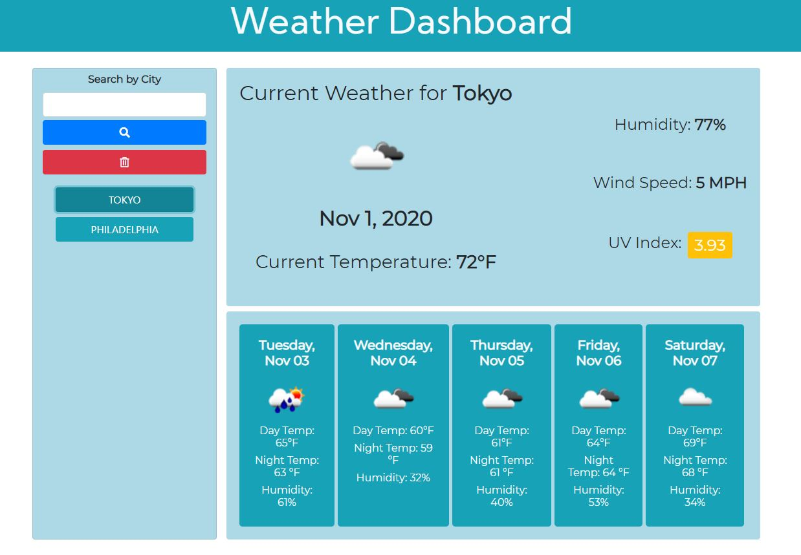

# Weather Dashboard

## Description
This is a weather forecast dashboard app. Users are able to enter a city name in the search box and have current weather conditions displayed for that city, as well a five day forecast.
The UV index value will change color from green, yellow and red based on the severity of the UV index.
Searched cities will be added below the search button and can be clicked on to display that cities weather data again.

### Screenshots
* Example of a searched city's current weather conditions and its five day forecast.

## Usage
- Type in a city name in the search box and press the `enter` key or the search icon.
- Current weather details and a 5-day forecast will be displayed for that city.
- Searched history is saved on the left column. Click a previous city to display the weather info again.
- To delete search history, click on the red delete icon.

## Tech Used
* [OpenWeather API](https://openweathermap.org/api)
* jQuery
* Javascript
* HTML
* CSS
* Bootstrap
* Moment.js
* Google Fonts
* Font Awesome

## Links
* Deployed Application: https://tchestnut85.github.io/weather-dashboard/
* GitHub Repository Link: https://github.com/tchestnut85/weather-dashboard/
